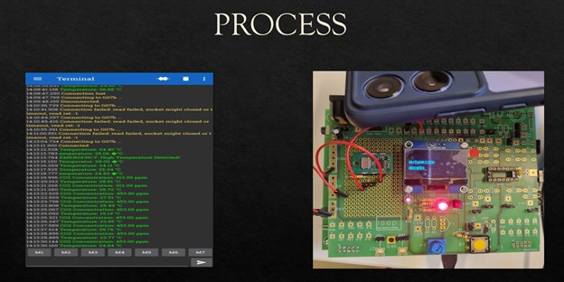

## Industrial Air Quality Monitoring System for Chemical Leak Detection:
This project focuses on developing a **real-time embedded system** for monitoring industrial air quality and detecting **toxic gas leaks** using sensor integration and signal processing techniques.  
It demonstrates expertise in **Embedded C**, **Tiva C microcontroller (TM4C123G)** programming, and **MATLAB-based analysis**.

## Project Overview:
Chemical leaks in industrial environments can cause severe safety hazards.  
This system continuously monitors air quality parameters such as **temperature, gas concentration, and sound anomalies**, triggering early alerts in case of unsafe conditions.

## Objectives
1. Build a reliable embedded safety system for chemical leak detection.  
2. Interface multiple sensors — CO₂, temperature, and acoustic — with the microcontroller.  
3. Process and analyze real-time data to identify anomalies.  
4. Integrate **MATLAB** for signal validation and visualization.  
5. Create a **low-cost, energy-efficient prototype** suitable for industrial use.

## Hardware Components
- **Tiva C LaunchPad (TM4C123GXL)**  
- **CO₂ Sensor** – for gas concentration detection  
- **LM35 Sensor** – for temperature measurement  
- **Microphone Sensor** – for acoustic signal detection  
- **Bluetooth Module (HC-05)** – for wireless data transfer  
- **Breadboard / PCB prototype**  
- **5V Power Supply**  

## Tools and Platforms:
Energia IDE (for TIVA LaunchPad)
MATLAB (Signal Processing & Analysis)

## 📈 Methodology
1. Acquire signals from gas, temperature, and sound sensors.  
2. Process sensor outputs using the ADC on Tiva LaunchPad.  
3. Apply filtering and threshold-based decision logic in firmware.  
4. Transmit real-time data via Bluetooth for monitoring.  
5. Validate and visualize results in MATLAB.  

## Demo Video
[Click here to watch the demo](Outputvid.mp4)
Please download and watch it, its not playable here.

